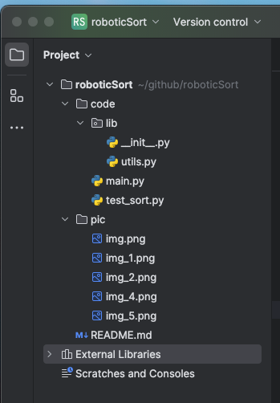
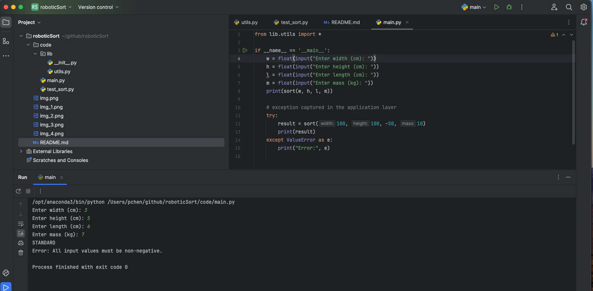
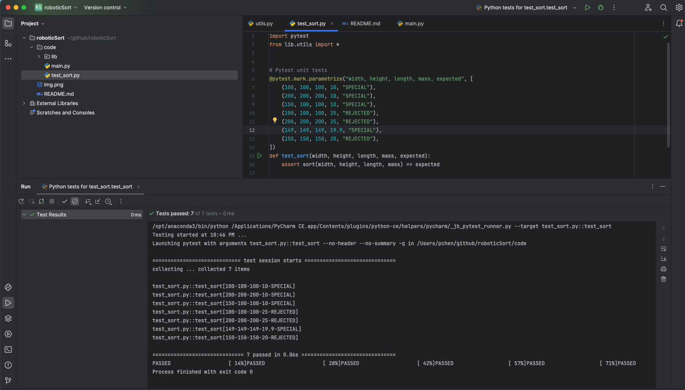
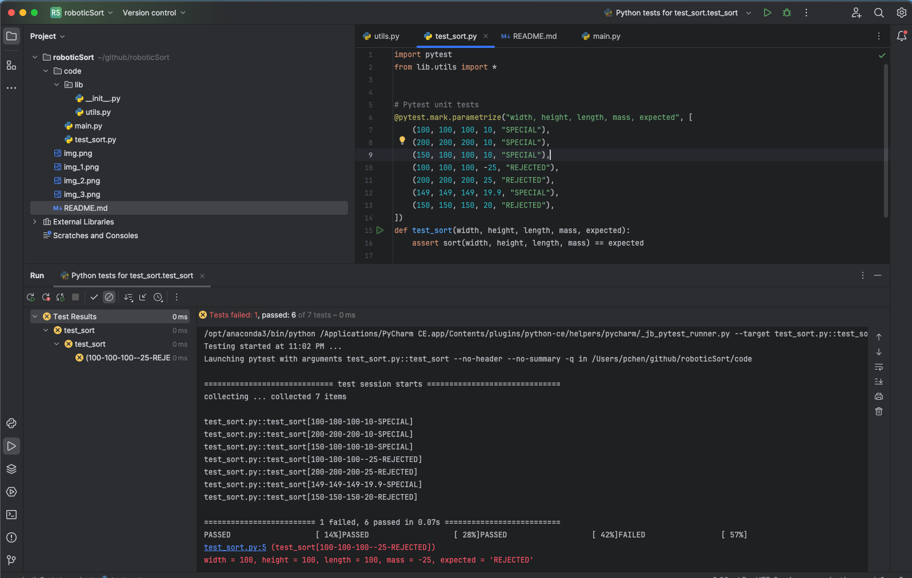

# 1. Code Introduction

## 1.1. Code Folder Structure

## 1.2. Application using the sort function

## 1.3.1. Unit Testing with valid inout

# 1.3.2. Unit testing with invalid inout

# 2. Core Engineering Technical Screen

### Objective

Imagine you work in Thoughtful’s robotic automation factory, and your objective is to write a function for one of its
robotic arms that will dispatch the packages to the correct stack according to their volume and mass.

### Rules

Sort the packages using the following criteria:

- A package is **bulky** if its volume (Width x Height x Length) is greater than or equal to 1,000,000 cm³ or when one
  of its dimensions is greater or equal to 150 cm.
- A package is **heavy** when its mass is greater or equal to 20 kg.

You must dispatch the packages in the following stacks:

- **STANDARD**: standard packages (those that are not bulky or heavy) can be handled normally.
- **SPECIAL**: packages that are either heavy or bulky can't be handled automatically.
- **REJECTED**: packages that are **both** heavy and bulky are rejected.

### Implementation

Implement the function **`sort(width, height, length, mass)`** (units are centimeters for the dimensions and kilogram
for the mass). This function must return a string: the name of the stack where the package should go.

### Submission Guidance

1. **Time Management**: Allocate no more than 30 minutes to complete this challenge.
2. **Programming Language**: You may use any programming language you're comfortable with. This is an opportunity to
   showcase your skills in a language you are proficient in.
3. **Submission Format**:
    - **Option 1**: Submit a public GitHub repository with clear README instructions.
    - **Option 2 (Preferred)**: Host your solution on an online IDE like [Repl.it](http://repl.it/) or CodePen for
      immediate code review. Ensure the link is accessible for direct execution.
4. **Evaluation Criteria**: Submissions will be assessed on:
    - Correct sorting logic.
    - Code quality.
    - Handling edge cases and inputs.
    - Test coverage.